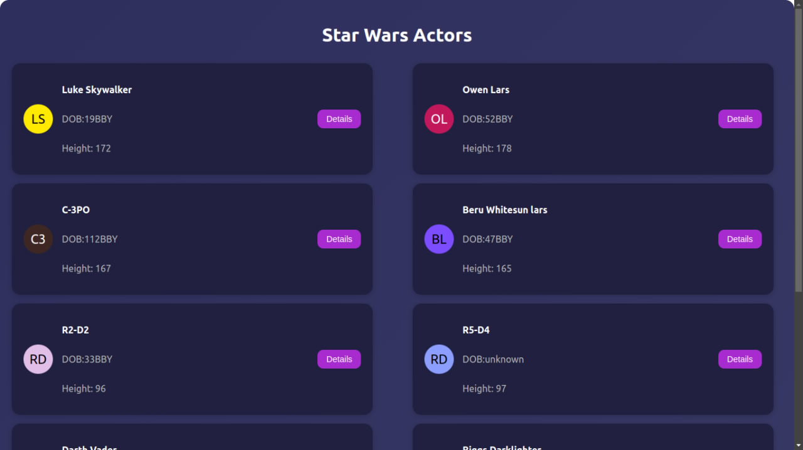
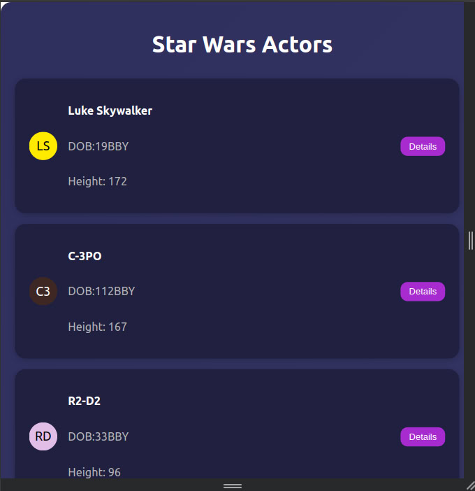
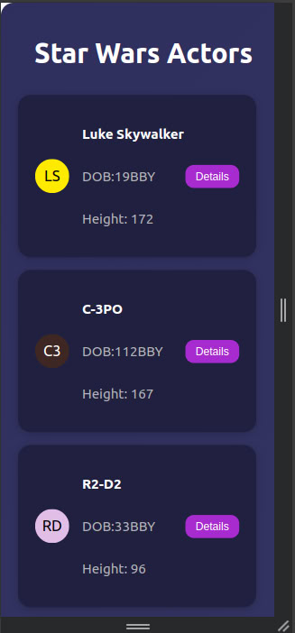
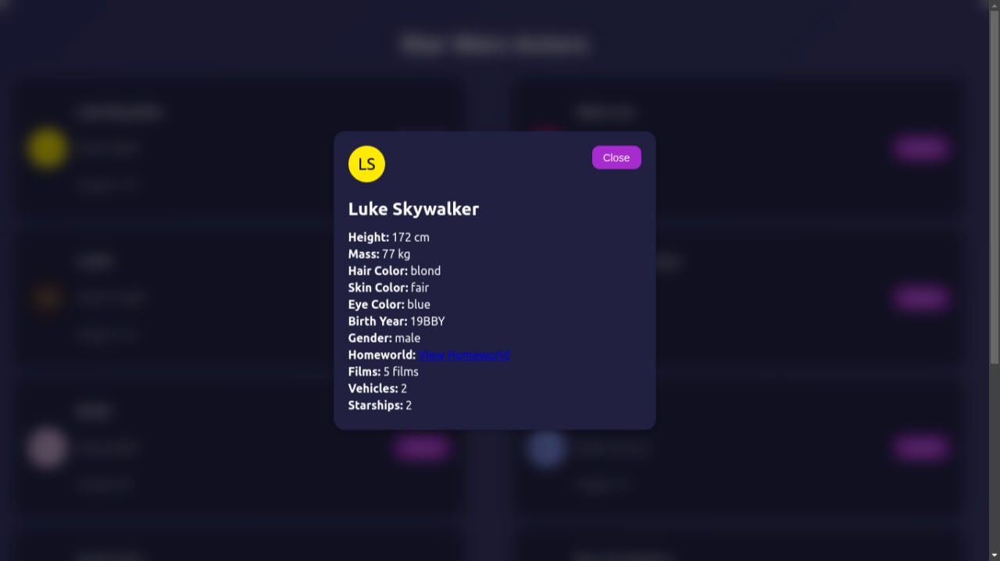

# Star Wars Actors

## Description

Star Wars Actors is a React-based application that fetches and displays a list of actors from the Star Wars universe. Users can click on an actor's card to view detailed information, including their attributes and film appearances.

## Features

- Fetches actor data from an API.
- Displays actors in a responsive layout.
- Allows users to view detailed information about each actor.
- Interactive design with a close button to hide details.

## Technologies Used

- **React**: JavaScript library for building user interfaces.
- **Redux Toolkit**: For state management.
- **React Testing Library**: For unit testing components.
- **CSS**: For styling the application.

## Screenshots

Here are some screenshots of the application for all sizes(large , medium and small):

# Desktop

# Tablet

# Mobile 

# Detail Component

## Installation

1. Clone the repository:
   git clone https://github.com/HanaGt/React-Challenge.git

2. Navigate to the project directory:
    cd React-Challenge
3. Install the dependencies:
    npm install
4. Start the application:
    npm start
5. Open your browser and visit http://localhost:3000 to view the application.
